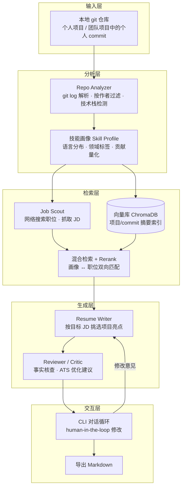
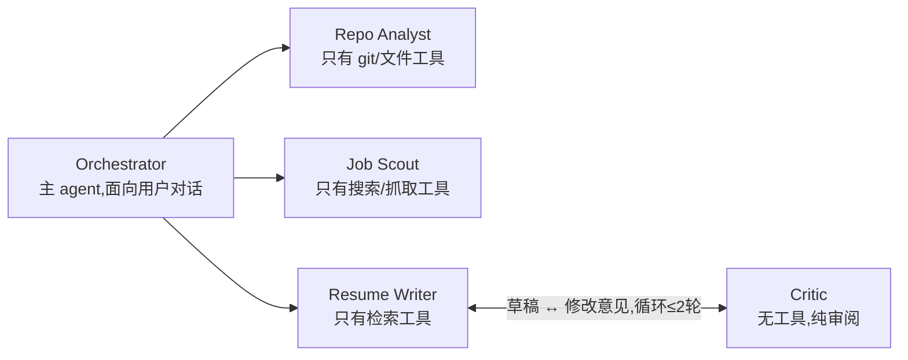

# Repo2Resume 设计文档

> 一个独立 CLI agent：分析本地代码仓库 → 生成技能画像 → 推荐匹配职位 → 针对目标职位生成简历 → 对话式修改 → 导出 Markdown。
>
> 已确定的技术决策：**混合架构（先 Skill 原型验证，再固化为独立 CLI）+ Python + 手写 agent loop + LiteLLM 多模型抽象 + MVP 做完整闭环**。

---

## 目录

0. [两阶段策略：Skill 原型 → 独立 CLI](#0-两阶段策略skill-原型--独立-cli)
1. [整体架构](#1-整体架构)
2. [技术栈选型](#2-技术栈选型)
3. [Agent 系统设计与提示词工程](#3-agent-系统设计与提示词工程)
4. [多智能体：要不要用，怎么用](#4-多智能体要不要用怎么用)
5. [Embedding、向量数据库与知识召回](#5-embedding向量数据库与知识召回)
6. [涉及的机器学习 / NLP 知识](#6-涉及的机器学习--nlp-知识)
7. [主流 Agent 框架与平台概览](#7-主流-agent-框架与平台概览)
8. [Prompt 调优与评测体系](#8-prompt-调优与评测体系)
9. [项目目录结构](#9-项目目录结构)
10. [开发路线图（Milestones）](#10-开发路线图milestones)

---

## 0. 两阶段策略：Skill 原型 → 独立 CLI

采用混合路线，分两个阶段交付。**本文档第 1-9 节描述的是阶段 B（独立 CLI）的目标架构，阶段 A 是它的低成本验证版。**

### 0.1 阶段 A：Skill 原型（1-2 天）

不写 agent 运行时，把整个流程做成**给 Cursor / Claude Code 用的一套 skill**，宿主 agent 提供大脑、工具调用和对话界面，我们只提供领域知识：

```
skill/
├── SKILL.md                    # 主流程说明书：四个环节的编排逻辑、事实清单规则、HITL 确认点
├── prompts/                    # 各环节的提示词片段（画像/搜索词/亮点挑选/bullet 写作/审稿 rubric）
├── templates/
│   └── resume.md.j2            # 简历 Markdown 模板
└── scripts/
    └── git_stats.py            # 遍历仓库,按作者过滤,输出统计 JSON（宿主 agent 会调用它）
```

流程即 SKILL.md 里写明的指令：① 调 `git_stats.py` 分析仓库 → LLM 汇总成技能画像；② 用宿主的网络搜索找职位并打分；③ 按 JD 挑亮点、按模板生成简历；④ 聊天窗口里讨论修改；⑤ 按模板写出最终 Markdown 文件。

**阶段 A 的目的不是"省事"，而是回答三个问题：**

1. **流程验证**：这条"代码 → 画像 → 职位 → 简历"的链路走通后，产出的简历质量到底行不行？哪个环节最弱？
2. **提示词沉淀**：画像汇总、亮点挑选、bullet 写作、审稿 rubric 这四组核心提示词，在真实数据（你自己的仓库）上快速迭代到能用的版本——这些就是阶段 B `prompts/` 目录的初稿。
3. **数据积累**：把阶段 A 的输入输出（git 统计 JSON、JD、生成的简历、你的修改意见）保存下来，直接成为阶段 B 评测集（第 8 节 golden dataset）的第一批数据。

### 0.2 阶段 B：独立 CLI（本文档主体）

把阶段 A 验证过的流程和提示词固化成 `repo2resume` CLI，替换掉宿主 agent 提供的三样东西：

| 阶段 A 由宿主提供 | 阶段 B 自己实现 | 对应章节 |
|---|---|---|
| Cursor/Claude Code 的 agent loop | 手写 tool-use 循环、上下文管理、状态持久化 | §1.2 |
| 宿主的对话界面 | Typer + Rich 终端对话（`chat` 命令） | §2 |
| 宿主的网络搜索工具 | Tavily/SerpAPI 职位搜索模块 | §2.1 |
| 宿主的"隐式智能"（自己决定看什么文件） | **显式的检索层：embedding、混合检索、rerank** | §5 |
| 单一 agent 完成所有环节 | **多智能体：Orchestrator + 子 agent + Writer-Critic** | §4 |

### 0.3 你关心的技能锻炼点还在吗？——都在，且全部落在阶段 B

阶段 A 恰恰**不做**多智能体和向量检索（宿主 agent 一把梭），这正好制造了对照组：

- **多智能体（§4）**：阶段 B Phase 4 把分析/搜索/写作/审稿拆成子 agent。你会亲身对比"一个大 agent 凭上下文硬扛"（阶段 A）和"多个聚焦 agent 分工"（阶段 B）的效果差异——这是学多智能体最好的方式。
- **向量库与召回策略（§5）**：阶段 A 里"从项目池挑亮点"靠 LLM 长上下文硬读，项目一多就会漏、会贵。阶段 B 用 ChromaDB + BM25 混合检索 + rerank 解决这个真实痛点——你是带着"见过它失败"的体感去实现 RAG 的，而不是为了用而用。
- **手写 agent loop 与 harness engineering（§1.2）**：完全是阶段 B 的内容，一点不少。而且阶段 A 你就是在一个成熟 harness（Cursor/Claude Code）**里面**工作——skill、工具调用、权限确认这些机制先以用户身份体验一遍，Phase 2/2.5 再自己造一遍，对照最直观。
- **评测与 prompt 调优（§8）**：反而被加强了——阶段 A 的真实产物直接喂给阶段 B 的评测集。

唯一的变化是顺序：先见到"能跑的全流程"（阶段 A），再逐块把宿主提供的能力换成自己的实现（阶段 B）。技能清单没有删减。

---

## 1. 整体架构

### 1.1 核心流程



### 1.2 Agent 运行时架构 = Harness Engineering

业界公式：**Agent = Model + Harness**。Harness 是模型之外的一切——循环、工具、上下文策略、权限、hooks、可观测性、恢复路径。**手写这一层就是本项目最主要的学习目标**，即 harness engineering 这门学科本身。

核心是一个**手写的 tool-use 循环**：

```
用户输入 → 组装上下文（系统提示词 + 会话历史 + 工具结果）
        → LLM 决策（回复 or 调用工具）
        → 若调用工具：pre-hook 校验 → 权限检查 → 执行工具 → post-hook → 结果回填上下文 → 再次调用 LLM
        → 循环直到 LLM 给出最终回复 or 达到最大轮数
```

对照 2026 年业界收敛出的 harness 组件清单（iteration loop、context management、tool registry、subagents、session persistence、prompt assembly、lifecycle hooks、permissions、observability），本项目逐一自建：

| 组件 | 职责 | 学到什么 | 阶段 |
|---|---|---|---|
| Agent Loop | tool-use 循环、最大轮数控制、停止条件 | agent 的本质就是"LLM + 循环 + 工具" | Phase 2 |
| Tool Registry | 工具的 schema 定义、注册、分发执行 | function calling 协议、JSON Schema；注册表是 harness 的扩展点——加能力=注册工具，不动循环 | Phase 2 |
| Context Manager | 会话历史管理、超长上下文截断/压缩（compaction） | token 预算、上下文压缩策略；长会话不压缩就会"context rot" | Phase 2 |
| Prompt Assembler | 系统提示词的动态组装：基础指令 + 当前状态摘要 + 工具说明按需注入 | 提示词不是静态字符串,是每轮重新构建的视图 | Phase 2 |
| State Store | 各阶段产物落盘（画像、职位、简历草稿）,会话可恢复 | agent 的持久化,跨 session 续作 | Phase 2 |
| HITL Gate / Permissions | 关键节点暂停确认；工具分级：只读工具自动放行,写文件/联网需确认 | human-in-the-loop、权限分层设计 | Phase 2.5 |
| Lifecycle Hooks | pre-tool-call（参数校验、注入约束）、post-tool-call（结果裁剪、事实清单核对）等确定性拦截点 | 用确定性代码兜住概率性模型——harness 的核心思想 | Phase 2.5 |
| Observability | 每轮 LLM 调用的 trace 落 SQLite：prompt、响应、工具调用、token 数、耗时、成本累计 | agent 调试全靠 trace;成本计量是生产必需 | Phase 2.5 |
| Error Recovery | 工具失败重试、LLM 输出解析失败的修复重问、循环卡死检测 | 恢复路径设计,agent 可靠性的关键 | Phase 2.5 |
| Subagent Runtime | 子 agent 即工具（独立上下文、独立工具集、结果摘要回传） | 多智能体编排 | Phase 4 |

---

## 2. 技术栈选型

### 2.1 总览

| 层 | 选型 | 理由 |
|---|---|---|
| 语言 | Python 3.11+ | 生态最全，参考项目多 |
| CLI 框架 | **Typer**（命令）+ **Rich**（终端渲染） | 现代 Python CLI 标配，Rich 能渲染 markdown/表格/进度条，对话体验好 |
| LLM 接入 | **LiteLLM** | 一套代码兼容 OpenAI / Anthropic / Gemini / Ollama，用户自带 key |
| 主力模型 | 推荐 Claude Sonnet 或 GPT-4o 级别（tool-use 强）；用户可切换 | 写作质量和工具调用可靠性是刚需 |
| Embedding 模型 | 云端：`text-embedding-3-small`；本地：**bge-m3**（多语言，中英简历场景友好） | 见第 5 节 |
| Git 分析 | **GitPython**（基础）+ **PyDriller**（commit 级遍历更省事） | 按作者过滤、diff 统计 |
| 代码解析（可选进阶） | tree-sitter | 分析函数/类级别的技术复杂度，二期再上 |
| 职位搜索 | **Tavily API**（LLM 友好的搜索）或 SerpAPI；抓取用 httpx + BeautifulSoup | 职位板反爬严重，MVP 用搜索 API 拿 JD 摘要即可，不做 Playwright 爬虫 |
| 向量数据库 | **ChromaDB**（嵌入式，零部署） | 本地文件即库，适合 CLI 工具 |
| 关键词检索 | SQLite FTS5（BM25） | 内置于 SQLite，零依赖实现混合检索 |
| 缓存 | **Redis**（Docker 运行） | LLM 响应、职位搜索结果等易失缓存；原生 TTL、哈希结构天然适合 |
| 结构化存储 | **SQLite** | 持久状态：技能画像、简历草稿、会话历史、trace/成本记录 |
| 容器化 | **Docker + docker-compose** | 一条 `docker compose up -d` 拉起 Redis；应用本身也提供 Dockerfile 可整体容器化 |
| 数据校验 | **Pydantic v2** | 定义所有结构化输出的 schema，LLM 输出直接校验 |
| 简历导出 | Jinja2 模板 → **Markdown 文件** | 无排版依赖；需要 PDF 时用户可自行 pandoc/浏览器打印（二期可选） |
| 配置 | `~/.repo2resume/config.toml` + 环境变量 | API key、默认模型、个人信息 |

### 2.2 前端 / 后端 / 数据库怎么定位

- **前端**：MVP 阶段**没有独立前端**，交互界面就是终端（Rich 渲染）。二期可以加一个 `repo2resume serve` 起本地 FastAPI + 简单页面做简历预览（参考 gitresume 的 dashboard），但不是必需。
- **后端**：没有常驻应用服务端。CLI 进程本身就是"后端"，所有逻辑本地运行，符合隐私优先（代码不出本机，只有摘要发给 LLM）。唯一的常驻服务是 Redis（Docker 容器）。
- **存储分工**：三件套各司其职——**Redis 管缓存**（易失数据，丢了可重建）、**SQLite 管持久状态**（画像、草稿、会话、trace，删库=丢工作成果）、**ChromaDB 管向量**。BM25 全文检索仍用 SQLite FTS5。
- **部署形态**：`docker compose up -d` 拉起 Redis 后 `pip install` 本地跑 CLI（开发默认）；或用 Dockerfile 把应用一起容器化（`docker compose --profile app up`），适合分发给不想配 Python 环境的用户。CLI 启动时探测 Redis 不可达则**自动降级为 SQLite 缓存**，保证没有 Docker 的环境也能跑通。

### 2.3 缓存策略

三级缓存，落在 Redis（key 设计体现用途）：

1. **分析缓存**：`analysis:{repo_path_hash}:{head_commit}` → 分析结果 JSON，不设 TTL（commit hash 变了 key 自然失效），代码没变就不重新分析。
2. **LLM 响应缓存**：`llm:{model}:{prompt_hash}` → 响应体，开发调试期极大省钱、加速迭代；可设长 TTL（如 7 天）防止无限膨胀。
3. **职位缓存**：`jobs:{query_hash}` → 搜索结果，`EX 86400`（24h TTL 由 Redis 原生管理），避免重复搜索。

实现上抽象一个 `CacheBackend` 接口（`get/set/ttl`），Redis 为默认实现，SQLite 表为降级实现——这也是一个干净的小型接口设计练习。

---

## 3. Agent 系统设计与提示词工程

### 3.1 提示词的分层组织

提示词是代码，要**版本化管理**。放在 `prompts/` 目录，每个提示词一个文件，模板变量用 Jinja2：

```
prompts/
├── analyzer/
│   ├── summarize_project.j2      # 输入 git 统计 + README，输出项目摘要
│   └── build_skill_profile.j2    # 汇总多项目，输出技能画像 JSON
├── jobs/
│   ├── generate_search_queries.j2 # 根据画像生成搜索词
│   └── score_job_fit.j2           # 职位打分（结构化输出）
├── resume/
│   ├── select_highlights.j2       # 按 JD 从项目池挑亮点
│   ├── write_bullets.j2           # 生成 STAR/量化风格的 bullet
│   └── critic_review.j2           # 审稿人：事实核查 + ATS 建议
└── system/
    └── orchestrator.j2            # 主 agent 系统提示词（含工具使用规范）
```

### 3.2 关键提示词工程技巧（本项目会用到的）

1. **结构化输出**：所有中间产物（画像、职位评分、简历 bullet）都定义 Pydantic schema，提示词里给出 JSON Schema 并要求严格输出，代码侧 `model_validate_json` 校验 + 失败重试。这是 agent 工程最重要的一课：**LLM 输出必须可被程序消费**。
2. **防幻觉约束**：简历生成最大的风险是编造。提示词中锁定"事实清单"（fact sheet）——真实的仓库名、commit 数、语言占比、日期——明确规定"只能重组和强调，不能发明数字和成果"。每条 bullet 要求附上来源（哪个仓库/哪些 commit），程序可溯源校验。
3. **Few-shot 示例**：`write_bullets.j2` 里放 2-3 组"输入统计 → 优秀 bullet"的示例，比抽象描述"要量化、要有动词"有效得多。
4. **角色与受众设定**：审稿人提示词设定为"挑剔的技术面试官 + ATS 系统"双视角。
5. **上下文预算**：commit message 截断（如 500 字符）、每仓库只送 top-N 文件路径，而不是把整个 git log 灌进去——学会控制送入模型的信息密度。

### 3.3 Prompt 调优流程

见第 8 节评测体系。核心思想：**没有评测的调优是玄学**。流程是：

```
收集失败案例 → 归类问题（幻觉/格式错误/亮点选错/语气不对）
→ 修改提示词（一次只改一个变量）
→ 跑回归评测集 → 对比得分 → 提交（提示词进 git，带 changelog）
```

---

## 4. 多智能体：要不要用，怎么用

### 4.1 什么是多智能体

单 agent = 一个 LLM 会话 + 一套工具 + 一个循环。**多智能体（multi-agent）= 多个各有独立系统提示词、独立上下文、独立工具集的 agent，通过某种协作模式共同完成任务。**

常见协作模式：

| 模式 | 说明 | 代表框架 |
|---|---|---|
| **Pipeline（流水线）** | agent A 的输出是 agent B 的输入，顺序执行 | 手写即可 |
| **Supervisor（主管-下属）** | 一个 orchestrator 决定把子任务派给哪个专家 agent | LangGraph |
| **Debate（辩论）** | Advocate 找理由支持、Critic 找理由反对、Judge 裁决 | Cadence 项目的职位匹配就用了这个 |
| **群聊协作** | 多 agent 在共享会话里自由发言 | AutoGen/AG2 |

多智能体的**真正收益**不是"更智能"，而是：① 每个 agent 的上下文更短更聚焦（避免长上下文中指令被稀释）；② 不同角色可以用不同模型（便宜模型做过滤、贵模型做写作）；③ 天然的关注点分离，提示词更好维护。

**代价**：token 消耗成倍增加、延迟叠加、agent 间信息传递会丢失细节、调试更难。

### 4.2 本项目的用法（推荐方案）

采用 **"Supervisor + Pipeline + 一处 Writer-Critic 循环"** 的混合结构，规模控制在 4 个角色：



- **Orchestrator**：唯一与用户对话的 agent，持有会话历史，负责把任务分派给专家并汇总结果。这就是你手写 agent loop 的宿主。
- **Repo Analyst / Job Scout**：作为"子 agent 工具"暴露给 Orchestrator——即 Orchestrator 的工具列表里有 `analyze_repos()`、`find_jobs()`，其内部实现是各自跑一个独立的小 agent loop。**这是学习多智能体最干净的实现方式：子 agent 即工具。**
- **Writer-Critic 循环**：简历生成后由 Critic 审一轮（事实核查 + ATS 建议），Writer 修订，最多 2 轮防止死循环。这是多智能体最经典、收益最明确的用法。

**实施建议：Phase 1-3 先用单 agent + 普通函数工具跑通全流程，Phase 4 再把分析和写作拆成子 agent。**先有能用的单体，再重构成多智能体，你能切身对比两种架构的差异——这比一上来就搭多智能体学到的多。

---

## 5. Embedding、向量数据库与知识召回

能用，而且是本项目**匹配质量的核心**。两个方向的检索都靠它：

### 5.1 应用场景

**场景 A：职位 → 项目亮点（简历定制的核心）**
给定目标 JD，从你所有项目/commit 摘要中召回最相关的素材。

- 索引内容：每个项目的 LLM 摘要、按主题聚合的 commit 组摘要（如"实现了 xx 服务的认证模块"）、README 要点。
- 查询：JD 的职责描述 + 技能要求。
- 这是标准 RAG：**检索到的项目素材作为上下文，喂给 Resume Writer 生成 bullet**。

**场景 B：技能画像 → 职位（职位推荐）**
把技能画像文本向量化，与搜到的职位 JD 向量比相似度，作为职位打分的信号之一（与 LLM 打分结合）。

### 5.2 混合检索（Hybrid Retrieval）

单用向量检索会漏掉精确术语匹配（如 JD 里要求 "Kubernetes"，向量可能召回"容器化经验"但排序不佳）。方案：

```
查询 ──┬─→ BM25 关键词检索（SQLite FTS5）─→ top 20 ─┐
       │                                            ├─→ RRF 融合 ─→ top 10 ─→ Rerank ─→ top 5
       └─→ 向量检索（ChromaDB, cosine）─→ top 20 ───┘
```

- **BM25**：SQLite FTS5 内置，捕捉精确技术名词匹配。
- **向量检索**：捕捉语义相似（"做过高并发消息队列" ≈ "分布式系统经验"）。
- **融合**：RRF（Reciprocal Rank Fusion），实现只有几行代码，无需调权重。
- **Rerank**：对融合后的 top 10 做精排，两种实现都可以做出来对比：
  1. **Cross-encoder 模型**：`bge-reranker-v2-m3`（本地跑，sentence-transformers 加载），query 和文档拼接后逐对打分——这是学习"双塔 vs 交叉编码"区别的最好实践。
  2. **LLM rerank**：把候选列表给便宜的 LLM 排序，实现简单但更贵。

### 5.3 Embedding 模型选择

| 方案 | 模型 | 特点 |
|---|---|---|
| 云端（默认） | OpenAI `text-embedding-3-small` | 便宜、质量稳、经 LiteLLM 统一接入 |
| 本地（隐私模式） | `bge-m3` | 中英双语强（中文简历场景重要），CPU 可跑 |

注意维度一致性：换 embedding 模型必须重建索引，索引元数据里记录模型名。

---

## 6. 涉及的机器学习 / NLP 知识

本项目**不需要训练模型**，但会实打实地用到这些原理（面试时都能讲出实践）：

| 知识点 | 在本项目中的体现 |
|---|---|
| 表示学习 / Embedding 原理 | 文本 → 稠密向量，余弦相似度度量语义距离；双塔（bi-encoder）与交叉编码（cross-encoder）的精度/速度权衡 |
| 经典 IR（信息检索） | BM25 / TF-IDF 的词频-逆文档频率思想；为什么稀疏检索和稠密检索互补 |
| 检索融合与排序 | RRF 融合、rerank 精排、召回率 vs 精确率的取舍 |
| Tokenization | 上下文预算管理、为什么中文 token 消耗更高、截断策略 |
| 结构化信息抽取 | 从 JD 里抽技能要求、从 commit message 抽工作主题（LLM 做，但要懂评估抽取质量） |
| 文本分类（轻量） | commit 按 Conventional Commits / 启发式规则分类（feat/fix/refactor），先规则后 LLM 的分层设计 |
| 评测方法论 | LLM-as-judge、golden dataset、检索指标（Recall@K、MRR） |

可选进阶（二期）：用标注过的"JD-项目相关性"数据微调 embedding 或训练一个小的打分模型——那才真正进入训练领域，MVP 不需要。

---

## 7. 主流 Agent 框架与平台概览

虽然我们手写 agent loop，但应该了解生态、借鉴设计模式：

| 框架/平台 | 类型 | 特点 | 对本项目的参考价值 |
|---|---|---|---|
| **LangGraph** (LangChain) | 代码框架 | 图状态机编排，节点=步骤/agent，支持 checkpoint、HITL 中断 | 它的 "interrupt + resume" 模式值得借鉴到我们的确认环节 |
| **OpenAI Agents SDK** | 代码框架 | 轻量，handoff（agent 间移交）概念清晰 | "子 agent 即工具"的官方版参照 |
| **Pydantic AI** | 代码框架 | 类型安全优先，结构化输出体验最好 | 我们用 Pydantic 校验 LLM 输出就是同一思想 |
| **Claude Agent SDK** (Anthropic) | 代码框架 | 把 Claude Code 的 agent 能力（工具、子agent、权限）开放为 SDK | 手写 loop 的对照组，它的工具权限设计值得学 |
| **AutoGen / AG2** (Microsoft) | 代码框架 | 多 agent 群聊协作范式 | 了解 debate/群聊模式即可 |
| **CrewAI** | 代码框架 | 角色扮演式多 agent（role/goal/backstory） | 角色化提示词的写法可参考 |
| **LlamaIndex** | 代码框架 | RAG 见长，检索管线组件丰富 | 混合检索/rerank 的实现可对照它的文档 |
| **Dify / Coze / n8n** | 低代码平台 | 拖拽式编排，适合非工程团队 | 了解即可，与我们锻炼目标相反 |

一个值得掌握的概念区分：**harness 是预装好的成品**（Claude Code、Codex、Cursor——循环、工具注册、权限层已经接好，指个任务就能跑），**framework 是零件套装**（LangChain、AutoGen——循环、工具分发、权限检查要自己接线）。我们做的事介于两者之间：用零件思路为 Repo2Resume 这个特定领域造一个小 harness。

**我们的立场**：手写 loop 学原理，但目录结构和抽象（Tool、Agent、State）向这些框架的共识靠拢，这样以后迁移或读框架源码都容易。

---

## 8. Prompt 调优与评测体系

这是"agent 系统开发"里最容易被跳过、但最体现工程能力的部分。

### 8.1 评测集（Golden Dataset）

在 `evals/` 下维护固定测试用例：

- **仓库分析**：准备 2-3 个公开仓库快照（或自己项目的脱敏统计 JSON）→ 期望的技能画像要点。
- **职位匹配**：10-20 条真实 JD + 人工标注的相关度（高/中/低）→ 算检索的 Recall@5、排序的 MRR。
- **简历生成**：给定素材 + JD → 用 checklist 评：是否有编造数字？每条 bullet 是否可溯源到 commit？是否包含 JD 关键词？长度是否合规？

### 8.2 评测方法

1. **程序化断言**（免费、每次跑）：JSON 格式合法性、必填字段、bullet 数量/长度、来源引用存在性、禁用词（"精通一切"式空话）。
2. **LLM-as-judge**（便宜模型，回归时跑）：按 rubric 给简历质量打 1-5 分（具体性/量化程度/与 JD 的相关性），与上一版对比。
3. **人工抽查**：你自己就是最终评委，对拿不准的 case 建立标注习惯。

### 8.3 调优纪律

- 提示词进 git，每次修改写明动机（解决了哪个失败案例）。
- 一次只改一个提示词变量，改完必跑回归评测。
- LLM 响应缓存让回归评测只对"受影响的调用"付费。
- 用一个简单的 `evals run` 命令输出前后对比表——这本身就是很好的工程练习。

---

## 9. 项目目录结构

```
Repo2Resume/
├── pyproject.toml              # 依赖与打包（pip install repo2resume）
├── docker-compose.yml          # Redis 服务（app profile 可选整体容器化）
├── Dockerfile                  # 应用镜像（可选）
├── README.md
├── DESIGN.md                   # 本文档
├── skill/                      # ★ 阶段 A 产物（结构见 §0.1）,阶段 B 开始后保留作参照
└── src/repo2resume/
    ├── cli.py                  # Typer 入口：analyze / jobs / resume / chat / export / evals
    ├── config.py               # 配置加载（~/.repo2resume/config.toml）
    ├── agent/
    │   ├── loop.py             # ★ 核心：手写 tool-use 循环
    │   ├── tools.py            # Tool 抽象、注册表、schema 生成
    │   ├── subagent.py         # 子 agent 即工具的封装（Phase 4）
    │   └── context.py          # 会话历史、token 预算、截断
    ├── prompts/                # Jinja2 提示词模板（见 3.1）
    ├── analysis/
    │   ├── git_miner.py        # PyDriller 遍历、按作者过滤、统计
    │   ├── tech_detector.py    # 依赖文件/扩展名 → 技术栈（规则,不用 LLM）
    │   └── profiler.py         # LLM 汇总 → SkillProfile
    ├── jobs/
    │   ├── search.py           # Tavily 搜索、JD 抓取
    │   └── matcher.py          # 打分 = 检索信号 + LLM 评分
    ├── retrieval/
    │   ├── embedder.py         # LiteLLM embedding / bge-m3
    │   ├── store.py            # ChromaDB + SQLite FTS5
    │   ├── hybrid.py           # RRF 融合
    │   └── rerank.py           # cross-encoder / LLM rerank
    ├── resume/
    │   ├── writer.py           # 亮点选取 + bullet 生成
    │   ├── critic.py           # 审稿 agent
    │   └── render.py           # Jinja2 模板 → Markdown 文件
    ├── storage/
    │   ├── db.py               # SQLite：持久状态（画像、草稿、会话、trace）
    │   ├── cache.py            # CacheBackend 接口：Redis 实现 + SQLite 降级实现
    │   └── models.py           # Pydantic：SkillProfile / Job / ResumeDraft...
    └── evals/
        ├── datasets/           # golden 数据
        └── runner.py           # 评测执行与对比报告
```

CLI 命令设计：

```bash
repo2resume init                      # 配置向导：API key、个人信息、模型选择
repo2resume analyze ~/code/*          # 分析仓库（可 --author 过滤）,生成技能画像
repo2resume jobs                      # 基于画像搜索并推荐职位
repo2resume resume --job <id>         # 针对某职位生成简历草稿
repo2resume chat                      # ★ 进入对话模式,与 agent 讨论修改（也可全程只用这一个命令）
repo2resume export                    # 导出 Markdown 简历
repo2resume evals run                 # 跑评测集
```

`chat` 是主入口（Orchestrator agent，自然语言驱动一切）；其余命令是直达各阶段的快捷方式，也方便单元测试各模块。

---

## 10. 开发路线图（Milestones）

### 阶段 A：Skill 原型（验证 + 沉淀）

| 阶段 | 内容 | 产出 | 预估 |
|---|---|---|---|
| **Phase A1** | 写 `git_stats.py`（按作者过滤的仓库统计脚本）；写 SKILL.md 主流程、简历 Markdown 模板与四组核心提示词 | 可被 Cursor/Claude Code 执行的完整 skill | 1 天 |
| **Phase A2** | 在自己的真实仓库上跑全流程 2-3 轮，迭代提示词；保存所有输入输出作为未来评测数据 | 验证过的提示词初稿 + golden dataset 种子数据 + 各环节质量结论 | 0.5-1 天 |

### 阶段 B：独立 CLI（固化 + 深化）

| 阶段 | 内容 | 关键学习点 | 预估 |
|---|---|---|---|
| **Phase 0** | 项目骨架：pyproject、Typer CLI、config、LiteLLM 封装、docker-compose 拉起 Redis、CacheBackend（Redis + SQLite 降级） | 工程化基础、Docker、缓存接口设计 | 1-2 天 |
| **Phase 1** | 仓库分析：PyDriller 挖掘 + 规则技术栈检测 + LLM 生成画像（结构化输出）。`git_stats.py` 和阶段 A 提示词在此固化 | 结构化输出 + Pydantic 校验、防幻觉的事实清单 | 2-3 天 |
| **Phase 2** | ★ 手写 harness 核心：agent loop + 工具注册表 + 上下文管理 + prompt 组装 + 状态持久化 + `chat` 对话模式（先接入分析工具） | function calling、上下文管理与 compaction、HITL | 3-4 天 |
| **Phase 2.5** | ★ harness 加固：lifecycle hooks、权限分级、trace/成本可观测、错误恢复 | harness engineering——用确定性代码兜住概率性模型 | 2-3 天 |
| **Phase 3** | 检索层：embedding 索引、混合检索、rerank；职位搜索 + 匹配打分 | RAG 全链路、BM25 vs 向量、RRF、cross-encoder | 3-4 天 |
| **Phase 4** | 简历生成：Writer-Critic 循环、子 agent 重构、Markdown 导出 | 多智能体、迭代修订循环 | 3-4 天 |
| **Phase 5** | 评测体系：golden dataset（从阶段 A 数据起步）、LLM-as-judge、`evals run` 对比报告；据此调优提示词 | 评测驱动的 prompt 工程 | 2-3 天 |

每个 Phase 结束都有可运行的产物；阶段 A 结束你就见过完整闭环的真实效果，Phase 2 结束你有自己写的能对话的 agent，Phase 4 结束就是完整 MVP。

---

## 附：风险与对策

| 风险 | 对策 |
|---|---|
| 职位板反爬（LinkedIn 等基本抓不到） | MVP 用 Tavily/SerpAPI 拿摘要，不硬刚爬虫；支持用户手动粘贴 JD |
| 简历幻觉（编造成果） | 事实清单锁定 + bullet 溯源 + Critic 核查 + 程序化断言 |
| LLM 成本失控 | 响应缓存、便宜模型做过滤/打分、贵模型只做最终写作 |
| 大仓库分析慢 | 按 HEAD hash 缓存、只取近 N 年 commit、增量分析 |
| 用户环境没有 Docker/Redis | CacheBackend 自动降级到 SQLite 实现，功能不受影响只是缓存特性变弱 |
| 隐私顾虑 | 只发送统计与摘要给 LLM，不发送源码全文；支持 Ollama 全本地模式 |
